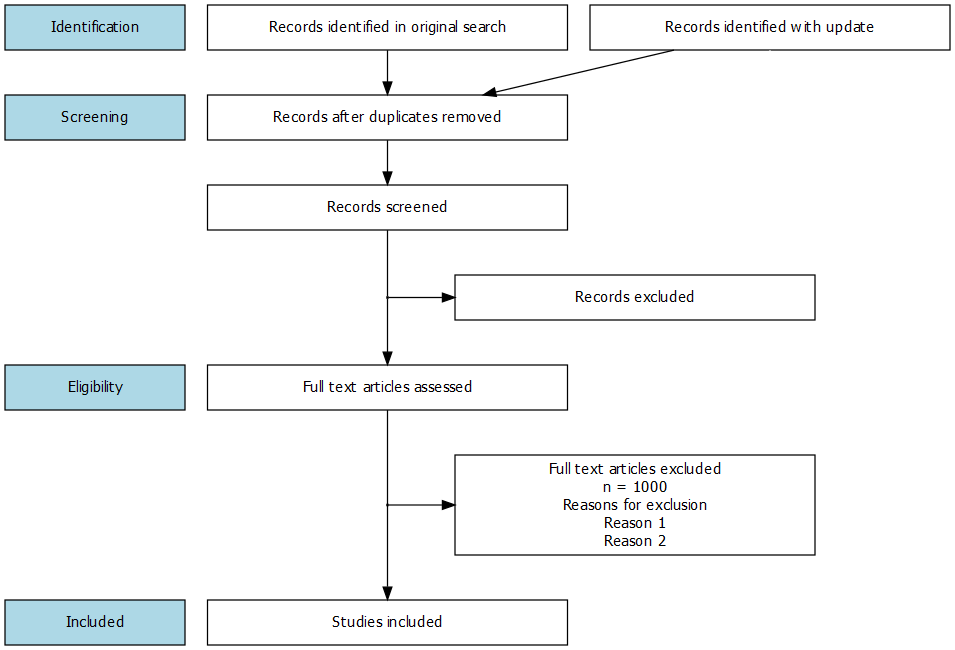

# How to make common social science diagrams using DiagrammeR

The [DiagrammeR package](http://rich-iannone.github.io/DiagrammeR/) is great for programmatically creating diagrams using the [GraphViz language](https://www.graphviz.org/).

However, it can be challenging to figure out how to create common graphs using GraphViz. Therefore, I compiled a list of some common graphs and plots to get you started.

## Concepts

Display hierarchies and relationships between theoretical constructs.

   
[Hierarchy of concepts](concepts/concept-relationships.r)

## Experiments

Randomization procedure.

  
[Randomized control trial, experiment and control group](experiments/rct-experiment-and-control-group.r) 

  
[Randomized control trial, experiment and control group - top down](experiments/rct-experiment-and-control-group-top-down.r) 

  
[2 x 3 factorial experiment with pre-test and post-test](experiments/factorial-experiment.r) 

## Causal diagrams

Variables and relationships, directed acyclic graphs (DAG's) etc.

  
[Cause and effect (2 variables)](causal-diagrams/cause-effect.r)

  
[Cause, mediator and effect (3 variables)](causal-diagrams/cause-mediator-effect.r)

  
[Cause, moderator and effect (3 variables)](causal-diagrams/cause-moderator-effect.r)

  
[Partial mediation with 1 mediator (3 variables)](causal-diagrams/mediation-one-mediator.r)

  
[Partial mediation with 2 mediators (4 variables)](causal-diagrams/mediation-two-mediators.r)

## Structural equation models

Latent factors and their indicators etc.

  
[Moderated mediation with latent factor](sem/moderated-mediation-sem.r)

## Meta-analysis

Flowcharts for inclusion and exclusion of studies.

  
[Meta-analysis flowchart for included and excluded studies](meta-analysis/meta-analysis-flowchart.r)

  
[Meta-analysis flowchart for included and excluded studies, with labels](meta-analysis/meta-analysis-flowchart-labels.r)

## See also

- [Example article: How to include DiagrammeR grViz code as vector graphics in PDF's](example-article.rmd)
